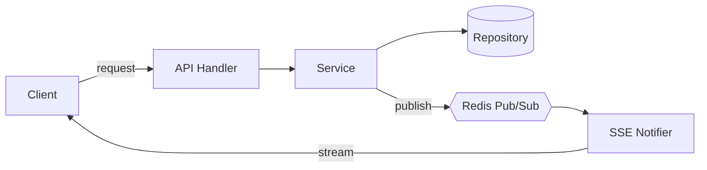
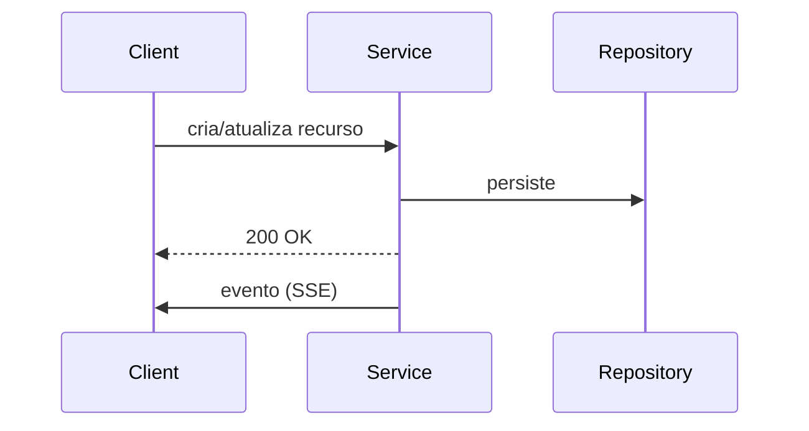

## Objetivo

Escrever uma **especificação técnica** (Technical Design Doc / RFC) em markdown no diretório `docs/specs/`, com nome de arquivo **numerado e incremental** (`001-...`, `002-...`, `003-...`), documentando decisões de arquitetura, **tradeoffs**, detalhes de implementação e **diagramas mermaid simplificados**.

Assunto da spec fornecido pelo usuário: **$ARGUMENTS**

Se `$ARGUMENTS` estiver vazio, pergunte ao usuário qual é o tema/decisão que a spec deve documentar antes de continuar.

## Passo 1 — Determinar o próximo número da spec

Execute para descobrir o maior número já usado e calcular o próximo (formato de 3 dígitos com zero à esquerda):

```sh
ls docs/specs/ 2>/dev/null | grep -oE '^[0-9]{3}' | sort -n | tail -1
```

- Se não existir nenhuma spec, o próximo número é `001`.
- Caso contrário, incremente o maior número encontrado (ex.: maior = `007` → próximo = `008`).
- O nome do arquivo deve ser: `docs/specs/NNN-titulo-em-kebab-case.md` (slug curto e descritivo derivado do assunto).

## Passo 2 — Coletar contexto do código

Antes de escrever, entenda o código relevante ao tema da spec:
- Use Grep/Glob/Read para localizar os arquivos, interfaces e fluxos afetados.
- Consulte `CLAUDE.md` e docs existentes em `docs/` para alinhar terminologia e arquitetura.
- Referencie arquivos reais como `caminho/arquivo.go:linha` quando descrever o estado atual.

## Passo 3 — Escrever a spec

Crie o arquivo usando **exatamente** a estrutura abaixo. Seja técnico e conciso; foque em decisões e tradeoffs, não em repetir código. Escreva em **português**.

```markdown
# NNN — <Título da Spec>

- **Status:** Draft <!-- Draft | Em revisão | Aprovada | Implementada | Descontinuada -->
- **Autor:** <nome do autor / git user>
- **Data:** <YYYY-MM-DD>
- **Specs relacionadas:** <NNN-... ou "nenhuma">

## 1. Contexto e Problema

Descreva o problema, a motivação e por que uma decisão precisa ser tomada agora. Inclua o estado atual do sistema (referenciando `arquivo:linha` quando útil) e as restrições (performance, consistência, compatibilidade, prazo).

## 2. Objetivos e Não-Objetivos

**Objetivos**
- ...

**Não-objetivos** (o que explicitamente fica de fora)
- ...

## 3. Solução Proposta

Explicação da abordagem escolhida em nível de arquitetura. Mantenha em nível de design — detalhes finos vão na seção 6.

### Diagrama de arquitetura



## 4. Alternativas Consideradas e Tradeoffs

Para cada alternativa relevante (incluindo a escolhida), descreva prós/contras. Use tabela para comparação direta.

### Alternativa A — <nome> (escolhida)
- **Prós:** ...
- **Contras:** ...

### Alternativa B — <nome>
- **Prós:** ...
- **Contras:** ...

### Comparação

| Critério            | Alternativa A | Alternativa B |
|---------------------|---------------|---------------|
| Consistência        | ...           | ...           |
| Complexidade        | ...           | ...           |
| Performance         | ...           | ...           |
| Custo operacional   | ...           | ...           |

**Decisão:** <qual foi escolhida e por quê, amarrando aos objetivos da seção 2>.

## 5. Fluxo / Sequência

Use um diagrama de sequência mermaid simplificado para o fluxo principal (mantenha poucos participantes e mensagens claras).



## 6. Detalhes de Implementação

- **Interfaces / contratos** afetados (assinaturas, DTOs).
- **Arquivos** a criar/alterar e responsabilidade de cada um.
- **Migrações de dados / schema** (se houver).
- **Tratamento de erros e casos de borda.**
- **Concorrência / idempotência / retries** relevantes.

## 7. Impactos

- **Compatibilidade / breaking changes:** ...
- **Segurança e autenticação:** ...
- **Performance e escala:** ...
- **Observabilidade (logs/métricas/tracing):** ...

## 8. Plano de Testes

- Testes unitários: ...
- Testes de integração / carga: ...
- Critérios de aceitação: ...

## 9. Plano de Rollout

- Feature flag / rollout gradual: ...
- Rollback: ...
- Passos de migração: ...

## 10. Questões em Aberto

- [ ] ...
```

## Regras dos diagramas mermaid

- **Simplicidade acima de tudo:** cada diagrama deve caber mentalmente de uma olhada — no máximo ~7 nós/participantes.
- Use o tipo adequado: `flowchart` para arquitetura, `sequenceDiagram` para fluxo temporal, `stateDiagram-v2` para estados, `erDiagram` para dados.
- Rotule as arestas com a ação/mensagem (ex.: `-->|publish|`).
- Prefira **vários diagramas pequenos** a um único diagrama gigante.

## Passo 4 — Confirmar

Após escrever o arquivo:
1. Informe o caminho completo do arquivo criado.
2. Mostre um resumo curto das principais decisões e tradeoffs documentados.
3. Sugira o próximo passo (revisão, implementação, ou uma spec relacionada).
