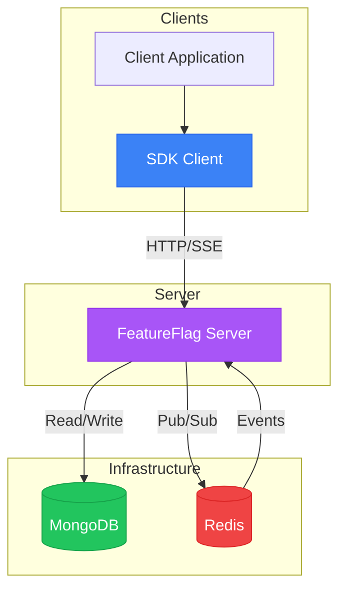

# Arch

## Infrastructure Diagram

## Components Description

### MongoDB
Primary database used for persistent storage of feature flags and content hub data. Stores all flag configurations, strategies, and metadata. Supports both read and write operations from the server.

### Redis
In-memory data store used as a message broker for the Pub/Sub pattern. When a feature flag is created or updated, the server publishes an event to Redis, which then broadcasts the change to all connected SDK clients via Server-Sent Events (SSE).

### FeatureFlag Server
The main HTTP server that exposes REST API endpoints for managing feature flags and content hub. It handles:
- CRUD operations for feature flags
- SSE endpoint for real-time updates
- Authentication and authorization
- Communication with MongoDB and Redis

### SDK
Client library that applications integrate to consume feature flags. Features include:
- HTTP client for fetching all flags on startup
- SSE listener for real-time flag updates
- In-memory cache for fast flag lookups
- Strategy evaluation (percentage-based, session-based)
- Automatic refresh mechanism for eventual consistency

### Client Application
Any application that integrates the SDK to use feature flags for controlling feature releases, A/B testing, or gradual rollouts.

## Data Flow

1. **Initial Load**: SDK fetches all flags from the server via HTTP
2. **Real-time Updates**: SDK maintains an SSE connection for instant flag changes
3. **Flag Changes**: When a flag is modified, server publishes to Redis → Redis broadcasts to SSE → SDK updates in-memory cache
4. **Flag Evaluation**: Application queries SDK → SDK returns cached flag value (no network call)

