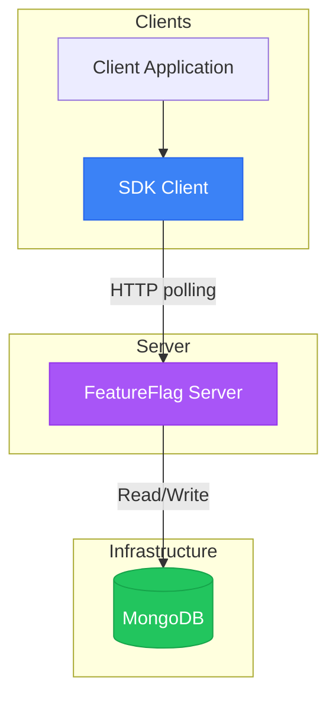

# Arch

## Infrastructure Diagram

```mermaid
graph TB
    subgraph Clients
        SDK[SDK Client]
        APP[Client Application]
    end

    subgraph Server
        API[FeatureFlag Server]
    end

    subgraph Infrastructure
        MONGO[(MongoDB)]
    end

    APP --> SDK
    SDK -->|HTTP polling| API
    API -->|Read/Write| MONGO

    style MONGO fill:#22c55e,stroke:#16a34a,color:#fff
    style SDK fill:#3b82f6,stroke:#2563eb,color:#fff
    style API fill:#a855f7,stroke:#9333ea,color:#fff
```

## Components Description

### MongoDB
Primary database used for persistent storage of feature flags and content hub data. Stores all flag configurations, strategies, and metadata. Supports both read and write operations from the server.

### FeatureFlag Server
The main HTTP server that exposes REST API endpoints for managing feature flags and content hub. It handles:
- CRUD operations for feature flags
- Authentication and authorization
- Communication with MongoDB

### SDK
Client library that applications integrate to consume feature flags. Features include:
- HTTP client for fetching all flags on startup
- Periodic HTTP polling to pick up flag changes
- In-memory cache for fast flag lookups
- Strategy evaluation (percentage-based, session-based)
- Automatic refresh mechanism for eventual consistency

### Client Application
Any application that integrates the SDK to use feature flags for controlling feature releases, A/B testing, or gradual rollouts.

## Data Flow

1. **Initial Load**: SDK fetches all flags from the server via HTTP
2. **Updates via polling**: SDK periodically re-fetches all flags (interval set by `WithEventualConsistency`) and updates its in-memory cache
3. **Flag Changes**: When a flag is modified, it is persisted to MongoDB and picked up by each SDK on its next poll (eventual consistency)
4. **Flag Evaluation**: Application queries SDK → SDK returns cached flag value (no network call)

