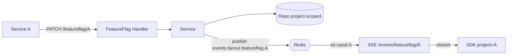
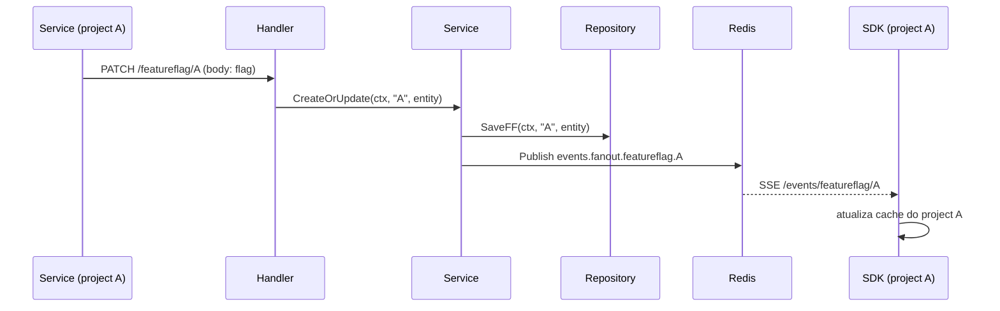

# 001 — Multi-project para Feature Flags (isolamento por contexto)

- **Status:** Implementada
- **Autor:** IsaacDSC
- **Data:** 2026-07-10
- **Specs relacionadas:** nenhuma

> **Nota de implementação (2026-07-10):** entregue conforme a seção 5. Decisões tomadas nas questões em aberto: (1) jsonfile usa **mapa aninhado** `map[project]map[flag]Entity` em arquivo único; (2) rota de listagem é `GET /featureflag/{project}/all`; (3) `project` validado por formato `^[a-z0-9][a-z0-9-]{0,63}$` (sem allowlist); (4) binding token↔project e Content Hub ficam para specs futuras. **Migração de dados não é necessária** — o serviço já nasce no formato multi-project.

## 1. Contexto e Problema

Hoje o domínio de Feature Flag é **global e single-tenant**. O prefixo de rota é fixo em `internal/featureflag/featureflag_handle.go:18`:

```go
const featureFlagPrefix = "/featureflag"
```

Toda flag vive em um único namespace: a chave de negócio é o `FlagName` (`internal/featureflag/featureflag.go:13`), e a unicidade é garantida por um índice único simples em `flag_name` no MongoDB (`internal/featureflag/featureflag_repository_mongodb.go:22`) ou por uma chave de mapa no jsonfile (`internal/featureflag/featureflag_repository.go:24`). Consequências do estado atual:

- Duas equipes/aplicações **não podem** ter uma flag `checkout.new-flow` com valores diferentes — a segunda sobrescreve a primeira.
- O fan-out via Redis usa um canal único `events.fanout.featureflag` (`internal/featureflag/featureflag_service.go:46` + `pkg/pubsub/publisher.go:40`). **Todo SDK conectado recebe todas as flags de todos os contextos**, vazando informação entre times e forçando cada cliente a manter em memória flags que não lhe pertencem.
- O SDK (`sdk/featureflag/sdk.go:76` e `:192`) faz bootstrap com `GET /featureflags` (todas) e assina `GET /events/featureflag` (tudo), sem qualquer noção de escopo.

Precisamos introduzir a dimensão **`project`** (um contexto/tenant lógico) de ponta a ponta, de forma que um project **não interfira** no outro: nem no armazenamento, nem na unicidade de nomes, nem no stream de eventos em tempo real. A decisão precisa ser tomada agora porque a introdução do escopo é **breaking** em armazenamento, wire format e canal de pub/sub — quanto mais flags existirem, mais cara a migração.

**Restrições:**
- Manter as duas trade-offs CAP já existentes (Feature Flag = AP com cache em memória + SSE).
- Manter compatibilidade com os dois backends de persistência (`jsonfile` e `mongodb`).
- Overhead operacional baixo: não queremos um cluster Redis novo nem um banco por project.

## 2. Objetivos e Não-Objetivos

**Objetivos**
- `project` como primeira dimensão de roteamento: `const featureFlagPrefix = "/featureflag/{project}"`.
- Unicidade de flag passa a ser **`(project, flag_name)`** — mesma flag pode coexistir em projects distintos com valores independentes.
- Isolamento de leitura: um cliente de `project=A` só enxerga (bootstrap + SSE + refresh) flags de `A`.
- Isolamento de eventos: publish e subscribe passam a ser **por project** (`events.fanout.featureflag.<project>`), de modo que o SDK de `A` nunca receba tráfego de `B`.
- SDK recebe o `project` na construção e opera exclusivamente dentro dele.
- Backends `jsonfile` e `mongodb` suportam o escopo com o mesmo `Adapter`.

**Não-objetivos**
- Autenticação/autorização por project (quem pode ler/escrever em qual project). Fica para spec futura; por ora o modelo de tokens estáticos atuais (`SERVICE_CLIENT`/`SDK_CLIENT`) permanece.
- Cotas, rate-limit ou billing por project.
- Aplicar a mesma mudança ao domínio **Content Hub** (CP). Esta spec cobre só Feature Flag; o padrão pode ser replicado depois.
- Criação/gestão de ciclo de vida de projects (CRUD de projects). Project é um identificador livre validado por formato, não uma entidade persistida.
- Migração automática de flags legadas para múltiplos projects (ver seção 8 para a estratégia manual).

## 3. Solução Proposta

Introduzir `project` como um **path parameter obrigatório** em todas as rotas de feature flag e propagá-lo por todas as camadas (handler → service → adapter → repositório → publisher), além do canal de SSE e do SDK.

- **Roteamento:** `PATCH /featureflag/{project}`, `GET /featureflag/{project}/all` (lista), `GET /featureflag/{project}/{key}`, `GET /featureflag/{project}/sdk/{key}`, `DELETE /featureflag/{project}/{key}`.
- **Chave de armazenamento:** a identidade lógica passa a ser o par `(project, flag_name)`. No MongoDB isso vira um **índice único composto**; no jsonfile, um mapa aninhado `project → flagName → Entity`.
- **Isolamento de eventos:** o canal Redis passa a ser sufixado pelo project (`events.fanout.featureflag.<project>`). O SSE expõe `GET /events/{resource}/{project}` e o SDK assina apenas o canal do seu project.
- **Entity/DTO:** ganham o campo `Project`, preenchido a partir do path (nunca confiando no corpo para o escopo).

O `project` é sempre a **fonte da verdade vinda da URL**: mesmo que o corpo da requisição contenha um campo `project`, ele é ignorado. Isso garante que o escopo seja explícito, auditável e imune a divergência entre path e payload.

### Diagrama de arquitetura



## 4. Fluxo / Sequência



## 5. Detalhes de Implementação

### 5.1 Entity e DTO
- `Entity` (`internal/featureflag/featureflag.go`): adicionar `Project string json:"project" bson:"project"`.
- `Dto` (`internal/featureflag/featureflag_dto.go`): `ToDomain` passa a receber o `project` do path como argumento e injetá-lo na entidade; **o `project` do corpo é ignorado** (fonte da verdade é a URL). Sugestão de assinatura: `ToDomain(project string, input Dto) (Entity, error)`, validando `project` não-vazio e com formato `^[a-z0-9][a-z0-9-]{0,63}$`.
- `featureflag_fields.go`: adicionar a constante `project = "project"`.

### 5.2 Adapter (interface) — `featureflag_interfaces.go`
Todas as assinaturas ganham `project`:
```go
type Adapter interface {
    SaveFF(ctx context.Context, project string, input Entity) error
    GetAllFF(ctx context.Context, project string) (map[string]Entity, error)
    GetFF(ctx context.Context, project, key string) (Entity, error)
    DeleteFF(ctx context.Context, project, key string) error
}
```

### 5.3 Repositório MongoDB — `featureflag_repository_mongodb.go`
- Substituir o índice único simples por **índice único composto** `{ project: 1, flag_name: 1 }` (novo helper em `pkg/mongodb`, já que `CreateUniqueIndex` hoje aceita um campo só).
- `filter` de `Save/Get/Delete` passa a ser `bson.M{"project": project, "flag_name": key}`; o `$set` inclui `project`.
- `GetAllFF` filtra por `bson.M{"project": project}` (não mais `bson.M{}`).

### 5.4 Repositório jsonfile — `featureflag_repository.go`
- Estrutura do arquivo muda de `map[flagName]Entity` para **`map[project]map[flagName]Entity`**.
- `GetAllFF(project)` retorna o submapa do project (ou vazio); `Save/Get/Delete` operam dentro do submapa.
- Alternativa mais simples de implementar (e recomendada para reduzir risco de corromper o arquivo): **um arquivo por project** (`featureflags.<project>.json`), derivando o path a partir do `project` — evita reescrever o mapa inteiro a cada save concorrente entre projects. Decidir na implementação (ver questão em aberto).

### 5.5 Service — `featureflag_service.go`
- Todos os métodos recebem `project` e o repassam ao adapter.
- **Publish com canal por project:** trocar `ff.pub.Publish(ctx, "featureflag", ...)` por `ff.pub.Publish(ctx, "featureflag."+project, ...)`, resultando em `events.fanout.featureflag.<project>` (`pkg/pubsub/publisher.go:40` concatena o prefixo). Nenhuma mudança necessária no `Publisher`.
- **Bug pré-existente a corrigir junto:** hoje o publish só ocorre no ramo de *update* (`featureflag_service.go:46`), não no de *create* (`:30`). Como parte desta spec, garantir publish em ambos para o SDK receber flags novas do seu project.

### 5.6 Handler — `featureflag_handle.go`
- `const featureFlagPrefix = "/featureflag/{project}"`.
- Cada handler lê `project := r.PathValue("project")`, valida formato e repassa ao service.
- Atenção ao padrão de rota de listagem: hoje é `GET %ss` → com o novo prefixo viraria `GET /featureflag/{project}s`, o que quebra o path param. **Trocar por uma rota explícita** `GET /featureflag/{project}/all` para não colar o `s` no segmento do parâmetro.

### 5.7 SSE notifier — `internal/sdknotifier/handle.go`
- Nova rota `GET /events/{resource}/{project}`; ler `project` e assinar `resource+"."+project` → canal `events.fanout.featureflag.<project>`.

### 5.8 SDK — `sdk/featureflag/sdk.go`
- `NewFeatureFlagSDK(host, project)` passa a exigir o project.
- Bootstrap: `GET %s/featureflag/%s/all` (só o project).
- SSE: `GET %s/events/featureflag/%s`.
- `refresh` usa o mesmo endpoint scoped; `filterChangedFlags`/`mergeFlags` continuam iguais (já operam sobre o mapa local, agora só do project).

### 5.9 Tratamento de erros e casos de borda
- `project` vazio/ inválido → `400 Bad Request` antes de tocar o service.
- Flag inexistente dentro do project → `404` (comportamento atual via `errorutils.NotFoundError`).
- Mesma `flag_name` em projects diferentes → permitido (garantido pelo índice composto).
- Concorrência: no MongoDB o upsert por filtro composto é atômico; no jsonfile a estratégia de arquivo-por-project reduz contenção entre projects.

## 6. Impactos

- **Compatibilidade / breaking changes:** rotas HTTP, wire format (`project` no schema), chave de storage, nome do canal Redis e assinatura do construtor do SDK **todos mudam**. É um bump major do serviço e do SDK.
- **Segurança e autenticação:** o `project` vem do path e não é autenticado — qualquer holder de `SDK_CLIENT_AT` pode ler qualquer project. Isolamento é de *dados/eventos*, não de *autorização* (ver não-objetivos e questão em aberto sobre binding token↔project).
- **Performance e escala:** query MongoDB fica indexada por `(project, flag_name)` (igual custo). Pub/sub passa a ter um canal por project — Redis suporta bem; N SDKs = N assinaturas.
- **Observabilidade:** incluir `project` como atributo nos logs (`ctxlog`) de create/update/get e nas mensagens do publisher/subscriber para permitir filtragem por contexto.

## 7. Plano de Testes

- **Unitários:** service e repositórios (mock, jsonfile, mongodb) com dois projects contendo a **mesma** `flag_name` e valores distintos, provando que um não sobrescreve o outro. Validação de `project` inválido → erro.
- **Integração:** subir Redis + Mongo (docker-compose), criar flag em `A`, assinar SSE de `A` e de `B`, e verificar que só o assinante de `A` recebe o evento.
- **Carga:** adaptar `loadtest/*` para incluir `project` no path e medir fan-out com múltiplos projects.
- **Critérios de aceitação:**
  - `PATCH /featureflag/A` + `PATCH /featureflag/B` com mesmo `flag_name` coexistem.
  - SDK `project=A` nunca recebe evento de `B` (nem no SSE nem no bootstrap).
  - `GET /featureflag/A/all` retorna apenas flags de `A`.

## 8. Plano de Rollout

- **Sem migração de dados:** não há base legada a preservar — o serviço parte com o layout multi-project desde o início (jsonfile aninhado e índice composto do MongoDB criados já no formato novo). Não é necessário backfill de `project` nem project `default`.
- **Rollout:** publicar servidor e SDK juntos (ambos assumem o path `/featureflag/{project}` e o canal `events.fanout.featureflag.<project>`).
- **Rollback:** reverter servidor **e** SDK na mesma janela, já que rotas e nome de canal mudam em conjunto. Manter a versão anterior taggeada.

## 9. Questões em Aberto

- [ ] jsonfile: mapa aninhado (`map[project]map[flag]Entity`) num só arquivo **ou** arquivo-por-project? (contenção vs. simplicidade)
- [ ] Vincular token ↔ project (autorização por contexto) — nesta spec ou em uma subsequente de segurança?
- [ ] Precisamos validar `project` contra uma allowlist (projects pré-registrados) ou aceitar qualquer identificador com formato válido?
- [ ] Content Hub deve seguir o mesmo padrão numa spec irmã?
```
