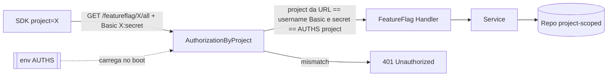
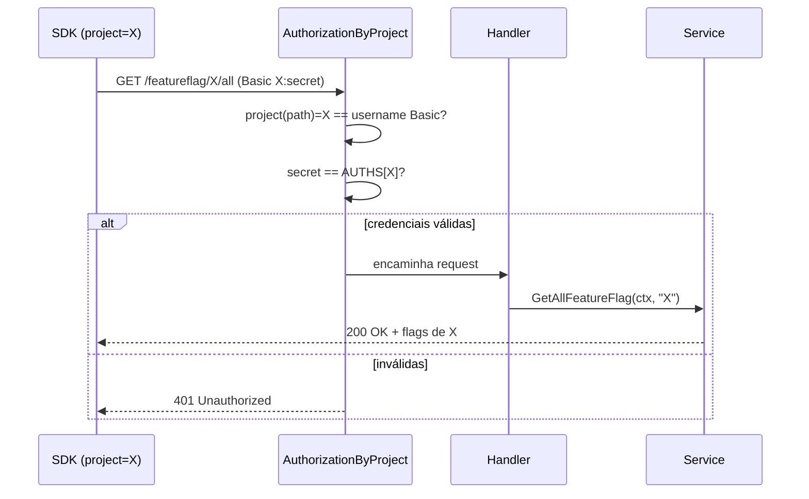

# 002 — Basic Auth por project via env (`AUTHS`)

- **Status:** Draft
- **Autor:** IsaacDSC
- **Data:** 2026-07-11
- **Specs relacionadas:** [001-multi-project-feature-flags.md](001-multi-project-feature-flags.md)

## 1. Contexto e Problema

A spec [001](001-multi-project-feature-flags.md) introduziu `project` como dimensão de roteamento e isolamento de dados (`/featureflag/{project}/...`), mas deixou explicitamente como não-objetivo o "binding token ↔ project" (ver seção 9 da 001). Hoje a autenticação continua **global e desacoplada do project**:

- `pkg/middlewares/middlewares.go:18-34` mapeia dois tokens estáticos vindos de env (`SERVICE_CLIENT_AT`, `SDK_CLIENT_AT`) para dois papéis fixos (`SERVICE_CLIENT`, `SDK_CLIENT`), sem qualquer noção de qual `project` está sendo acessado.
- Quem possui `SDK_CLIENT_AT` consegue ler **qualquer** project — não existe segredo por project.
- O endpoint efetivamente usado pelo SDK, o bootstrap/polling `GET /featureflag/{project}/all` (`internal/featureflag/featureflag_handle.go:180-213`, chamado por `sdk/featureflag/sdk.go:104`), **não tem nenhum middleware de auth hoje** — é público para quem souber o nome do project.
- O endpoint `GET /featureflag/{project}/sdk/{key}` (`internal/featureflag/featureflag_handle.go:28,142-178`) está protegido por `Authorization` + `CheckPermission(..., USERNAME_SDK)`, mas o `sdk/featureflag/sdk.go` **nunca envia** o header `Authorization` em nenhuma chamada (`grep` em `sdk/` não retorna nenhum `SetBasicAuth`/`Authorization`) — ou seja, essa rota está inacessível ao SDK real tal como está implementado hoje, e não é usada por ele (o SDK só chama `/all`).
- `PATCH /featureflag/{project}` (criação/atualização) também está **sem nenhum middleware** (`featureflag_handle.go:24`) — gap pré-existente fora do escopo desta spec, mas registrado aqui por ser adjacente ao tema.

O pedido é reaproveitar o modelo de auth já existente (`pkg/middlewares`, `internal/env`) e adicionar uma camada de **Basic Auth por project**, com as credenciais carregadas via variável de ambiente (`AUTHS`), fechando a lacuna real: hoje não há como restringir o acesso de leitura de um project a quem realmente é dono dele.

**Restrições:**
- Reaproveitar a infraestrutura de middleware existente (`Authorization`/`CheckPermission` em `pkg/middlewares`), não criar um subsistema de auth paralelo.
- `env-required` via `cleanenv` já valida presença de env vars no boot (`internal/env/env.go:26-33`) — a nova config deve seguir o mesmo padrão.
- Sem infra nova (sem tabela de usuários, sem serviço de identidade externo) — segredo simples por project, como os tokens estáticos atuais.

## 2. Objetivos e Não-Objetivos

**Objetivos**
- Introduzir `AUTHS map[string]string` em `internal/env/env.go`, carregado via env, associando `project → secret`.
- Adicionar um novo middleware de Basic Auth que valida a dupla `(project, secret)` contra `AUTHS`, usando o `project` da própria URL (`r.PathValue("project")`) como fonte da verdade — igual ao padrão já estabelecido na spec 001 (o corpo/credencial nunca sobrepõe o path).
- Aplicar esse middleware nas rotas de **leitura por SDK**: `GET /featureflag/{project}/all` (bootstrap/polling real do SDK) e `GET /featureflag/{project}/sdk/{key}`.
- Atualizar `sdk/featureflag/sdk.go` para enviar `Authorization: Basic base64(project:secret)` nas chamadas HTTP, já que hoje ele não envia autenticação nenhuma.
- Resolver a lacuna identificada na spec 001: impedir que um segredo de um project leia dados de outro project.

**Não-objetivos**
- Trocar a auth das rotas administrativas (`PATCH /featureflag/{project}`, `DELETE .../{key}`, `GET .../{key}` direto) — essas continuam com o token global `SERVICE_CLIENT_AT` via `Authorization` + `CheckPermission(..., USERNAME_SERVICE)`. Ver seção 4 para o porquê.
- Corrigir o gap pré-existente de `PATCH /featureflag/{project}` estar sem middleware (mencionado no Contexto por ser adjacente, mas tratado em spec/PR separado).
- Aplicar o mesmo padrão ao Content Hub (CP) — hoje nem sequer tem a dimensão `project` (ver não-objetivos da spec 001).
- Rotação automática de segredos, múltiplos segredos por project (rotação sem downtime) ou expiração — segredo é estático, igual ao modelo atual de `SERVICE_CLIENT_AT`/`SDK_CLIENT_AT`.
- CRUD de credenciais via API/admin UI — `AUTHS` é só env, igual ao restante da config (`internal/env/env.go`).

## 3. Solução Proposta

Adicionar uma nova variável de ambiente `AUTHS`, do tipo `map[string]string`, no formato nativo já suportado pelo `cleanenv` (`chave:valor` separados por vírgula — ver `parseMap` em `cleanenv.go:216-239`):

```sh
AUTHS="projectx:s3cr3t-x,projecty:s3cr3t-y"
```

Um novo middleware, `middlewares.AuthorizationByProject`, substitui `Authorization`+`CheckPermission(..., USERNAME_SDK)` nas rotas de leitura do SDK. Ele:

1. Lê `project := r.PathValue("project")` (mesmo valor que o handler já usa).
2. Faz `username, secret, ok := r.BasicAuth()` (parsing padrão do `net/http` para `Authorization: Basic ...`).
3. Rejeita com `401` se `!ok`, se `username != project` (a credencial tem que ser *para aquele* project, não apenas uma credencial válida qualquer) ou se `subtle.ConstantTimeCompare([]byte(secret), []byte(AUTHS[project])) != 1`.
4. Em caso de sucesso, segue para o handler (sem necessidade de `CheckPermission` adicional — a validação já é por project, não por papel genérico).

As rotas administrativas (`SERVICE_CLIENT_AT`) **não mudam** — continuam usando `Authorization`/`CheckPermission` exatamente como hoje.

### Diagrama de arquitetura



## 4. Alternativas Consideradas e Tradeoffs

### Alternativa A — Basic Auth por project via `AUTHS` (escolhida)
- **Prós:** reaproveita `net/http.Request.BasicAuth()` (stdlib, zero dependência nova); reaproveita o padrão de middleware existente; segredo por project fecha exatamente a lacuna da spec 001; `cleanenv` já sabe parsear `map[string]string` sem código extra.
- **Contras:** Basic Auth trafega credencial em toda requisição (mitigado por já rodar atrás de TLS/gateway, igual aos tokens estáticos atuais); segredo estático sem rotação; se um `project` tiver o segredo vazado, a troca exige redeploy (mesma limitação do modelo atual).

### Alternativa B — JWT assinado por project (claim `project`)
- **Prós:** permite expiração, rotação e escopo mais granular (claims); reaproveita `pkg/authutils` (já usa `golang-jwt/jwt/v5`).
- **Contras:** exige um endpoint de emissão de token (`/auth` já existe para outro fluxo, cookie-based) e gestão de chave; complexidade desproporcional ao problema (segredo estático por project já resolve o isolamento pedido); nenhuma infra de emissão/renovação existe hoje para o SDK.

### Alternativa C — Manter tokens globais, mas incluir `project` como claim assinado manualmente (HMAC por request)
- **Prós:** evita reenviar segredo em toda request.
- **Contras:** exige lib de assinatura client-side no SDK, muito mais complexo que Basic Auth para o ganho de segurança marginal neste contexto (rede interna, TLS já assumido).

### Comparação

| Critério            | A — Basic Auth por project | B — JWT por project        | C — HMAC por request       |
|---------------------|-----------------------------|------------------------------|------------------------------|
| Consistência        | Igual ao modelo atual (estático) | Suporta expiração        | Igual ao modelo atual       |
| Complexidade         | Baixa (stdlib)              | Média/Alta (emissão + verificação) | Alta (assinatura client-side) |
| Performance         | Igual (comparação em memória) | Leve overhead de verify JWT | Leve overhead de HMAC       |
| Custo operacional   | Baixo (só env var)          | Médio (endpoint de emissão) | Alto (implementação SDK)    |

**Decisão:** Alternativa A. Fecha o objetivo principal (segredo por project, sem vazamento entre projects) com o menor custo de implementação e reaproveitando 100% da infra de middleware e de env já existente — consistente com o pedido original de "usar o que já temos de auth".

## 5. Fluxo / Sequência



## 6. Detalhes de Implementação

### 6.1 Config — `internal/env/env.go`
```go
type Environment struct {
    // ...campos existentes...
    Auths map[string]string `env:"AUTHS" env-required:"true"`
}
```
- Mesma validação `env-required` que os demais segredos (`SecretKey`, `ServiceClientAT`, `SDKClientAT`).
- Formato aceito (nativo `cleanenv`, `parseMap` em `cleanenv.go:216-239`): `AUTHS="projectx:secretx,projecty:secrety"`. Sem suporte nativo a JSON — não usar o formato `{'projectx': 'xxxx'}` do exemplo original, que exigiria um parser customizado sem ganho real.

### 6.2 Middleware — `pkg/middlewares/middlewares.go`
Novo:
```go
func AuthorizationByProject(h http.HandlerFunc) http.HandlerFunc {
    return func(w http.ResponseWriter, r *http.Request) {
        project := r.PathValue("project")
        username, secret, ok := r.BasicAuth()
        cfg := env.Get()
        expected, exists := cfg.Auths[project]

        if !ok || !exists || username != project ||
            subtle.ConstantTimeCompare([]byte(secret), []byte(expected)) != 1 {
            w.Header().Set("WWW-Authenticate", `Basic realm="featureflag-sdk"`)
            w.WriteHeader(http.StatusUnauthorized)
            return
        }

        w.Header().Set("Content-Type", "application/json")
        h.ServeHTTP(w, r)
    }
}
```
- Import novo: `crypto/subtle` (comparação em tempo constante, evita timing attack na verificação do segredo).
- Não precisa de `CheckPermission` adicional: a validação já é o próprio project, não um papel genérico.

### 6.3 Rotas — `internal/featureflag/featureflag_handle.go`
```go
fmt.Sprintf("GET %s/all", featureFlagPrefix):       middlewares.AuthorizationByProject(handler.getAll),
fmt.Sprintf("GET %s/sdk/{key}", featureFlagPrefix): middlewares.AuthorizationByProject(handler.getFeatureFlagBySDK),
```
- `PATCH`, `DELETE {key}`, `GET {key}` **não mudam** (continuam com `SERVICE_CLIENT_AT` via `Authorization`/`CheckPermission`).

### 6.4 SDK — `sdk/featureflag/sdk.go`
- `NewFeatureFlagSDK(hostFF, project string)` passa a exigir também o `secret`: `NewFeatureFlagSDK(hostFF, project, secret string)`.
- Bootstrap/refresh (`sdk.go:104`, chamado também pelo `refresh` em `sdk.go:198`): trocar `http.Get(...)` por um `http.NewRequest` + `req.SetBasicAuth(project, secret)` + `ff.client.Do(req)`, já que `http.Get` não permite setar headers.
- **Breaking change de assinatura** — consumidores do SDK precisam passar o novo `secret` na construção.

### 6.5 Tratamento de erros e casos de borda
- `project` sem entrada em `AUTHS` → trata como credencial inválida (`401`), nunca vaza se o project existe ou não.
- `Authorization` ausente ou malformado (`r.BasicAuth()` retorna `ok=false`) → `401` com `WWW-Authenticate: Basic`.
- `username` do Basic Auth diferente do `project` da URL → `401` (mesmo que o secret esteja certo para outro project — impede reuso cruzado de credencial).
- Comparação de secret sempre via `subtle.ConstantTimeCompare` (evita side-channel por tempo de resposta).

## 7. Impactos

- **Compatibilidade / breaking changes:** assinatura de `NewFeatureFlagSDK` muda (novo parâmetro `secret`); rotas `GET .../all` e `GET .../sdk/{key}` passam a exigir Basic Auth onde antes (no caso de `/all`) não exigiam nada. Servidor e SDK devem subir juntos.
- **Segurança e autenticação:** fecha a lacuna citada na spec 001 (token↔project). Reduz superfície: hoje `/all` é público; após a mudança, exige segredo do project correto. `SERVICE_CLIENT_AT` continua como super-usuário para as rotas administrativas (não reduzido nem ampliado por esta spec).
- **Performance e escala:** overhead desprezível (comparação de string/mapa em memória por request).
- **Observabilidade:** logar `project` (já seria natural via `ctxlog`, alinhado com a recomendação da spec 001) nas tentativas de auth rejeitadas, para detectar tentativas de acesso cruzado entre projects.

## 8. Plano de Testes

- **Unitários:** `AuthorizationByProject` — credencial correta passa; secret errado, username≠project, project ausente de `AUTHS`, header ausente/malformado → todos `401`. Reaproveitar padrão de `pkg/middlewares` (mocks/testes já existentes no pacote).
- **Integração:** subir servidor com `AUTHS="a:seca,b:secb"`; SDK com `project=a, secret=seca` consegue bootstrap de `/featureflag/a/all`; o mesmo SDK tentando `secret=secb` ou acessando `/featureflag/b/all` recebe `401`.
- **Critérios de aceitação:**
  - SDK com segredo correto do seu project bootstrap/poll com sucesso.
  - SDK com segredo de outro project (ou sem segredo) recebe `401` em `/all` e `/sdk/{key}`.
  - Rotas administrativas (`PATCH`/`DELETE`/`GET {key}`) continuam funcionando com `SERVICE_CLIENT_AT`, sem regressão.

## 9. Plano de Rollout

- **Sem migração de dados** — mudança é só na camada de auth, não no storage (spec 001 já cobriu isso).
- **Rollout:** definir `AUTHS` com um segredo por project existente antes do deploy do servidor; atualizar todos os consumidores do SDK para a nova assinatura de `NewFeatureFlagSDK` (com `secret`) **na mesma janela**, já que o servidor passa a exigir a credencial imediatamente após o deploy.
- **Rollback:** reverter servidor e SDK juntos (mesma janela); manter versão anterior taggeada, igual ao rollout descrito na spec 001.
- **Comunicação:** cada equipe dona de um `project` precisa receber seu segredo antes do corte — isso é operação manual (distribuição de segredo), não coberta por esta spec.

## 10. Questões em Aberto

- [ ] `PATCH /featureflag/{project}` hoje está sem nenhum middleware (gap pré-existente, `featureflag_handle.go:24`) — corrigir numa spec/PR de segurança separado, ou já aproveitar este ciclo?
- [ ] Vale unificar também as rotas administrativas (`SERVICE_CLIENT_AT`) para um segredo por project no futuro, ou o token global de admin é aceitável permanentemente?
- [ ] Rotação de segredo (`AUTHS`) sem downtime — hoje exige redeploy; se isso virar dor operacional, precisa de spec própria (ex.: suportar 2 segredos válidos por project durante a janela de rotação).
- [ ] O endpoint `GET /featureflag/{project}/sdk/{key}` não é chamado pelo SDK atual (só `/all`) — mantê-lo com a nova auth mesmo sem uso real, ou avaliar removê-lo em spec separada?
