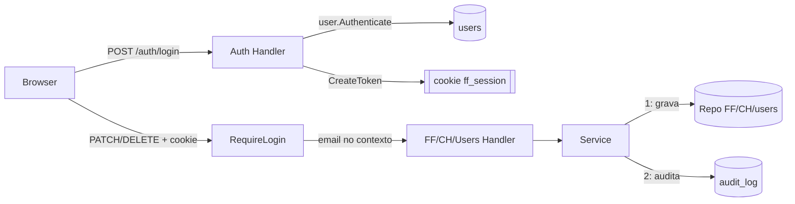
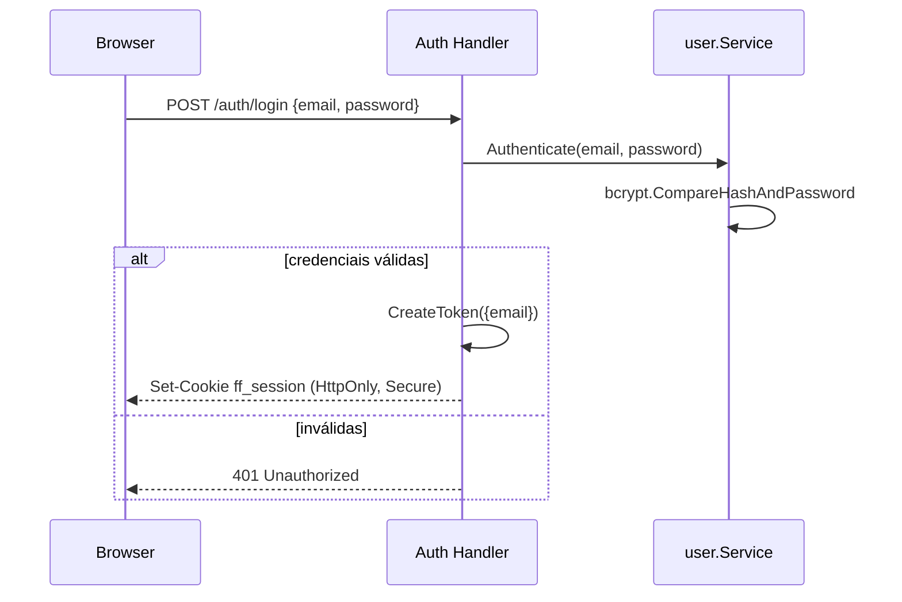
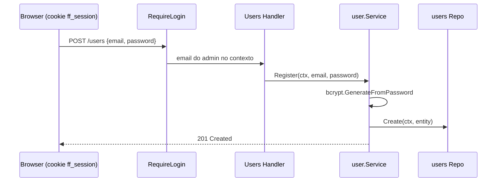
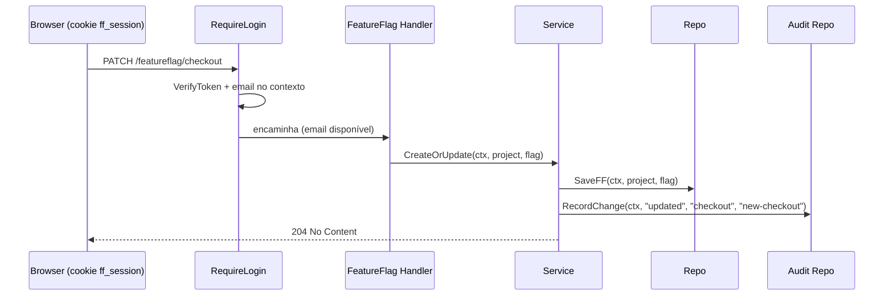
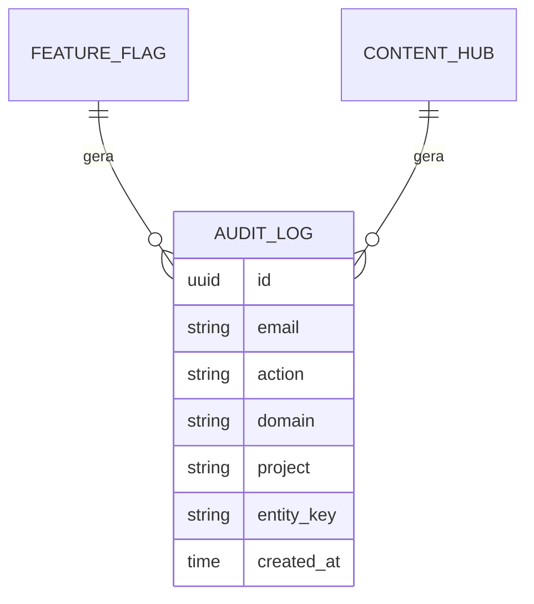

# 003 — Área de Login e Trilha de Auditoria de Alterações

- **Status:** Draft
- **Autor:** IsaacDSC
- **Data:** 2026-07-18
- **Specs relacionadas:** [002-basic-auth-por-project.md](002-basic-auth-por-project.md)

## 1. Contexto e Problema

Hoje não existe nenhum conceito de **usuário humano** no sistema. Levantamento no código (`internal/`, `pkg/`) não encontra nenhuma struct `User`/`Account`, nenhum campo `email`, nenhuma tabela de credenciais. Toda a "autenticação" existente é feita via segredos estáticos de máquina:

- `pkg/middlewares/middlewares.go:18-34` mapeia dois tokens fixos (`SERVICE_CLIENT_AT`, `SDK_CLIENT_AT`) para dois papéis (`SERVICE_CLIENT`, `SDK_CLIENT`), sem qualquer noção de "quem" fez a chamada — só "qual tipo de cliente".
- `middlewares.Authorization` está **comentado globalmente** em `cmd/main.go:67` — qualquer rota que não seja individualmente decorada fica 100% aberta.
- `POST /auth` (`internal/auth/auth_handler.go:19-42`) já emite um JWT via `pkg/authutils` (`golang-jwt/jwt/v5`, já em `go.mod`), mas:
  - É protegido pelo próprio token estático (`middlewares.Authorization`), não por email/senha.
  - O claim `data` do JWT (`authutils.CreateToken(data any)`, `pkg/authutils/auth.go:11-26`) recebe hoje apenas o papel resolvido (`"SERVICE_CLIENT"`/`"SDK_CLIENT"`) — **não existe claim de email**.
  - O cookie `token` é setado sem `Secure`/`HttpOnly`/`SameSite` (`auth_handler.go:37-41`).
  - `middlewares.Authentication` (`middlewares.go:69-88`), que lê esse cookie e valida o JWT, **não está aplicado a nenhuma rota** hoje e, mesmo quando usado, não propaga a identidade para o contexto da request (só valida e segue).
  - `authutils.VerifyToken` (`auth.go:28-44`) usa `jwt.Parse` sem checar o `SigningMethod` do token — vulnerabilidade clássica de "algorithm confusion" em bibliotecas JWT, latente porque a rota não é usada em produção, mas que deve ser corrigida ao tocar este código.
- As rotas administrativas hoje têm cobertura de auth inconsistente:
  - `PATCH /featureflag/{project}` (criação/atualização) — **sem nenhum middleware** (`internal/featureflag/featureflag_handle.go:25`), gap já registrado como aberto na spec 002 (seção 10, item 1).
  - `DELETE /featureflag/{project}/{key}` e `GET /featureflag/{project}/{key}` — protegidas por `Authorization`+`CheckPermission(SERVICE_CLIENT)`.
  - Todas as rotas de Content Hub (`PATCH`, `DELETE`, `GET .../all`, `GET .../{key}`, `GET .../sdk/{key}`) estão com o middleware **comentado** (`internal/contenthub/contenthub_handle.go:19-25`) — 100% abertas.
  - O Dashboard (`internal/dashboard/dashboard_handle.go`) é um `http.FileServerFS` puro, sem qualquer auth — quem souber a URL usa a UI de administração livremente.
- Não existe nenhum registro de **quem** alterou o quê e **quando**. `docs/USAGE_GUIDE.md:69` já lista "Audit Requirements: Basic" como limitação conhecida do serviço.

O pedido tem dois eixos que esta spec trata de forma conjunta (o segundo depende do primeiro para existir: só dá para gravar "quem" mudou algo se existir login real):

1. Uma área de login real (email/senha), com todas as rotas administrativas (dashboard + APIs de escrita) exigindo sessão autenticada.
2. Uma trilha de auditoria persistida — para cada alteração (criação/atualização/remoção), gravar o email extraído do JWT da sessão, a ação e o momento.

**Restrições:**
- Reaproveitar a infraestrutura já existente sempre que possível: `pkg/authutils` (JWT), o padrão de middleware de `pkg/middlewares`, o padrão de repositório duplo (jsonfile + MongoDB) usado por `featureflag`/`contenthub`, e os helpers de índice de `pkg/mongodb`.
- Sem infra nova pesada (sem IdP externo, sem serviço de identidade) — v1 deve caber no mesmo modelo operacional atual (config via env, redeploy para mudanças de credencial), assim como a spec 002 fez para `AUTHS`.
- Não pode quebrar silenciosamente os fluxos de SDK (rotas `.../all`, `.../sdk/{key}`) nem a spec 002, que já reserva essas rotas para um mecanismo de auth próprio (Basic Auth por project, focado em máquina).

## 2. Objetivos e Não-Objetivos

**Objetivos**
- Introduzir um domínio persistido de usuário humano (`internal/user`, Entity `{email, password_hash}` + Adapter + Service, com repositório jsonfile + MongoDB, no mesmo padrão de `featureflag`/`contenthub`) e uma área de login real: `GET /auth/login` (página) + `POST /auth/login` (autentica) + `POST /auth/logout`.
- Expor uma API de gestão de usuários — `POST /users` (criar), `DELETE /users/{email}` (remover), `GET /users` (listar, sem expor o hash) — todas exigindo uma sessão de login já válida (ver seção 6.10 sobre o bootstrap do primeiro usuário, que por definição não pode depender de já haver alguém logado).
- Emitir, no login bem-sucedido, um JWT com claim `email`, guardado em cookie de sessão dedicado (`ff_session`, `HttpOnly`+`Secure`+`SameSite=Lax`), **sem reusar** o cookie `token` já usado pelo fluxo `/auth` existente (que continua intocado).
- Criar um novo middleware (`middlewares.RequireLogin`) que valida essa sessão e propaga o email autenticado via contexto (`ctxutils`), seguindo exatamente o padrão já usado por `Authorization` (`middlewares.go:48-67`).
- Aplicar `RequireLogin` no Dashboard inteiro (`/dashboard/*`), nas rotas de gestão de usuários e nas rotas administrativas hoje sem cobertura adequada ou totalmente abertas: `PATCH`/`DELETE {key}`/`GET {key}` de featureflag e `PATCH`/`DELETE {key}`/`GET all`/`GET {key}` de content hub — fechando o gap do `PATCH /featureflag/{project}` já registrado na spec 002.
- Criar uma trilha de auditoria persistida (`internal/audit`, com repositório jsonfile + MongoDB, no mesmo padrão dos demais domínios) que grava, para cada alteração feita através das rotas acima: **email**, **ação** (`created`/`updated`/`deleted`), **domínio** (`feature_flag`/`content_hub`), **project** (quando aplicável) e **entidade** (flag/key), com timestamp.
- Corrigir, de forma incidental mas necessária, a checagem de `SigningMethod` ausente em `authutils.VerifyToken`.
- Redigir automaticamente o campo `password` do log de request/response gerado por `middlewares.Logger` (`middlewares.go:139-186`, aplicado globalmente a toda rota em `cmd/main.go:68`), para que `POST /auth/login` e `POST /users` nunca vazem senha em texto puro nos logs da aplicação (ver seção 4.4 e 6.12).

**Não-objetivos**
- Self-service de senha (esqueci minha senha, troca de senha pelo próprio usuário) — só um admin já logado cria/remove contas via `POST`/`DELETE /users`; o próprio usuário não gerencia sua conta nesta v1.
- Diferenciação de papéis/permissões entre usuários (RBAC) — todo usuário criado tem acesso administrativo total; granularidade de permissão fica para spec futura.
- Autenticação via IdP externo (OAuth/OIDC/SSO corporativo) — fica registrado como alternativa na seção 4, mas fora do escopo de v1.
- Alterar as rotas `GET /featureflag/{project}/all`, `GET /featureflag/{project}/sdk/{key}`, `GET /featureflag/projects` e os equivalentes de content hub voltados a SDK — essas rotas são escopo da spec 002 (Basic Auth por project) e permanecem como estão até aquela spec ser implementada. Ver seção 10 sobre a sobreposição entre as duas specs.
- Remover ou substituir `SERVICE_CLIENT_AT` — o token estático de máquina continua funcionando em paralelo ao login humano (ver seção 4), coexistência deliberada para não quebrar automações existentes (CI/CD, scripts).
- UI de consulta à trilha de auditoria (tela de histórico no dashboard) — v1 só grava; consulta/relatório é não-objetivo, registrado como questão em aberto.
- Diff completo (before/after) de cada alteração — v1 grava apenas a identificação da entidade afetada e a ação, não o payload completo (ver seção 4 para o porquê).

## 3. Solução Proposta

### 3.1 Domínio de usuário

Usuário humano vira um domínio persistido de primeira classe, `internal/user`, seguindo exatamente o padrão já usado por `featureflag`/`contenthub` (Entity + Adapter + Service + repositório jsonfile e MongoDB). `Entity{Email, PasswordHash, CreatedAt}` — a senha nunca é persistida em texto puro, só o hash bcrypt.

Uma API de gestão fica disponível para quem já está logado: `POST /users` (cria, recebe senha em texto puro sobre a sessão autenticada e o servidor faz o hash), `DELETE /users/{email}` (remove) e `GET /users` (lista email + data de criação, nunca o hash). Isso resolve o pedido de ter "uma área de user que contenha email e password" como um domínio real, não como configuração estática.

Como `POST /users` exige login, o **primeiro** usuário não pode ser criado por essa API (ninguém está logado ainda num ambiente novo) — ver seção 4.2 para o mecanismo de bootstrap escolhido (seed condicional via env, só quando a coleção de usuários está vazia).

### 3.2 Login

`POST /auth/login` recebe `{"email", "password"}`, busca o usuário em `internal/user` por email e compara a senha com `bcrypt.CompareHashAndPassword` contra o `PasswordHash` persistido. Em caso de sucesso, chama `authutils.CreateToken(map[string]string{"email": email})` (reaproveita o primitivo genérico existente, sem alterar sua assinatura) e seta o cookie `ff_session`.

### 3.3 Gate de acesso

`middlewares.RequireLogin` lê o cookie `ff_session`, valida o JWT (`authutils.VerifyToken` + `GetDataJWT`), extrai `email` e grava no contexto via `ctxutils.SetContext(ctx, middlewares.EMAIL_KEY, email)`. Rotas administrativas (incluindo as novas de gestão de usuários) passam a exigir **ou** um `Authorization: SERVICE_CLIENT_AT` válido (máquina) **ou** uma sessão de login válida (humano) — ver seção 6.4 para a composição exata dos dois mecanismos.

### 3.4 Auditoria

Cada método de escrita nos serviços (`featureflag.Service.CreateOrUpdate`/`RemoveFeatureFlag`, `contenthub.Service.CreateOrUpdate`/`RemoveContentHub`) passa a chamar, após a escrita no repositório ter sucesso, um novo colaborador `Auditor` que lê o email do contexto (`middlewares.EMAIL_KEY`) e grava uma entrada em `internal/audit` (repositório próprio, jsonfile + MongoDB). O hook fica no **service**, não no repositório — motivo detalhado na seção 4.3.

### Diagrama de arquitetura



## 4. Alternativas Consideradas e Tradeoffs

### 4.1 Onde guardar os usuários

#### Alternativa A — Semeados via env `ADMIN_USERS`, só em memória
- **Prós:** zero infraestrutura nova; mesmo padrão já validado pela spec 002 (`AUTHS`); `cleanenv` já sabe parsear `map[string]string`; nenhuma migração de dado.
- **Contras:** adicionar/remover usuário exige redeploy; sem self-service; **não atende ao pedido explícito de existir uma área de usuário persistida** — usuários em memória desaparecem a cada restart do processo e não há como listar/criar/remover via API.

#### Alternativa B — Domínio `internal/user` persistido (jsonfile + MongoDB), com API de gestão (escolhida)
- **Prós:** usuário é uma entidade real (email + hash de senha), com `POST`/`DELETE`/`GET /users` seguindo o mesmo padrão de `Entity`/`Adapter`/`Service`/`Handler` já usado por `featureflag`/`contenthub`; consistente com o pedido do usuário de ter "uma área de user"; sobrevive a restarts; permite adicionar/remover admins sem redeploy.
- **Contras:** mais superfície de código para v1 (domínio novo completo); precisa resolver o problema de "ovo e galinha" do primeiro usuário (ver seção 4.2).

#### Alternativa C — IdP externo (OAuth/OIDC, ex.: Google Workspace)
- **Prós:** sem gestão de senha própria; MFA/rotação ficam com o provedor; mais seguro no longo prazo.
- **Contras:** exige fluxo OAuth completo (redirect, callback, state/PKCE), nova dependência, complexidade desproporcional ao tamanho atual do time/projeto.

### Comparação

| Critério          | A — env `ADMIN_USERS` | B — domínio `user` persistido | C — IdP externo |
|--------------------|------------------------|----------------------|------------------|
| Complexidade       | Baixa                  | Média                | Alta             |
| Custo operacional  | Redeploy por usuário   | Baixo após bootstrap | Baixo (delegado) |
| Consistência com o repo | Igual à spec 002  | Igual ao resto (Entity/Adapter) | Novo padrão |
| Atende "área de user" persistida | Não | Sim | Sim |
| Segurança a longo prazo | Ok para poucos admins | Ok | Melhor |

**Decisão:** Alternativa B. O pedido explícito é ter uma área de usuário real (email + password) com API de gestão, não apenas config estática — isso só é possível com um domínio persistido. Fica consistente com o padrão de Entity/Adapter/Service/Handler já usado no resto do projeto, ao custo de mais código de v1 do que a Alternativa A.

### 4.2 Como semear o primeiro usuário (bootstrap)

Como `POST /users` exige uma sessão de login válida (seção 6.3), é preciso um mecanismo separado para criar o primeiro usuário — nenhuma das opções abaixo expõe criação de usuário sem autenticação de forma permanente.

#### Alternativa A — Seed condicional via `ADMIN_USERS` no boot, só se a coleção estiver vazia (escolhida)
- **Prós:** reaproveita o mesmo padrão de env já usado para `SECRET_KEY`/`SERVICE_CLIENT_AT`/`AUTHS`; não expõe nenhum endpoint sem autenticação, nem mesmo temporariamente; não precisa de binário/entrypoint adicional.
- **Contras:** lógica de "seed apenas se vazio" roda a cada boot (checagem leve, `COUNT`/`ListAll`); se alguém apagar todos os usuários por engano, o próximo restart re-semeia a partir do env — precisa logar claramente quando isso acontece para não passar despercebido.

#### Alternativa B — Comando CLI separado (`go run ./cmd/seed-admin -email=... -password=...`)
- **Prós:** comportamento explícito, sem lógica condicional escondida no boot do servidor principal.
- **Contras:** mais um entrypoint para manter e documentar; exige acesso operacional direto ao ambiente/banco para rodar, sempre manual.

#### Alternativa C — Endpoint de bootstrap auto-desabilitado (`POST /users/bootstrap`, sem auth, só funciona com zero usuários)
- **Prós:** bootstrap via HTTP puro, sem precisar de acesso a env/infra.
- **Contras:** pior perfil de segurança das três — janela de corrida em um ambiente recém-criado (dois requests concorrentes, ou alguém descobrindo a URL antes do time criar a própria conta).

**Decisão:** Alternativa A. É a que nunca expõe superfície não-autenticada, mesmo que temporariamente, e reaproveita exatamente o padrão de seed via env que o projeto já usa para todo o resto de configuração sensível.

### 4.3 Onde interceptar a escrita para gravar auditoria

#### Alternativa A — Hook explícito no Service (escolhida)
- **Prós:** só audita as 4 escritas que representam **mudança real de configuração** (`CreateOrUpdate`/`Remove*` de cada domínio); evita ruído.
- **Contras:** toca o código de 2 services (baixo risco, métodos pequenos e já testados).

#### Alternativa B — Decorator em volta do `Adapter` (repositório)
- **Prós:** nenhuma mudança nos services; auditoria "de graça" para qualquer chamada de escrita.
- **Contras:** **inviável neste código sem refatoração maior** — `featureflag.Service.GetFeatureFlag`/`GetFeatureFlagBySDK` (`featureflag_service.go:52-82`) também chamam `repository.SaveFF` internamente, só para persistir contadores de rollout (`SetQtdCall`) a cada leitura via SDK. Um decorator no repositório não distingue "usuário mudou a flag" de "SDK leu e o contador foi incrementado", e essas chamadas nem sempre têm um usuário logado no contexto (vêm de rotas de SDK, autenticadas por token estático/Basic Auth por project). Auditar nesse nível geraria uma entrada de auditoria por *leitura* de SDK, sem email disponível — puro ruído.

**Decisão:** Alternativa A. É a única que consegue distinguir "alteração feita por um humano logado" de "efeito colateral interno de uma leitura de SDK".

### 4.4 Como evitar vazar senha em texto puro nos logs

`middlewares.Logger` (`middlewares.go:139-186`) já loga `request_body`/`response_body` de **toda** requisição, sem exceção, e é aplicado globalmente em `cmd/main.go:68`. A partir desta spec, dois corpos passam a conter senha em texto puro (`POST /auth/login`, `POST /users`) — sem alguma mitigação, toda tentativa de login e toda criação de usuário grava a senha em texto puro no log da aplicação.

#### Alternativa A — Redação genérica por nome de campo no corpo JSON (escolhida)
- **Prós:** funciona para qualquer rota atual ou futura que tenha um campo `password` no corpo, sem exigir que quem adicionar uma rota nova lembre de atualizar uma lista; implementação pequena e local a `middlewares.Logger`.
- **Contras:** só redige campos de **primeiro nível** do JSON (suficiente para os corpos atuais, que são planos: `{"email","password"}`); não redige senha aninhada em uma estrutura mais profunda, caso isso venha a existir no futuro.

#### Alternativa B — Lista de rotas excluídas do log de corpo (`"POST /auth/login"`, `"POST /users"`)
- **Prós:** mais simples de entender à primeira vista.
- **Contras:** frágil por construção — qualquer rota nova com campo sensível (ex. uma futura `PATCH /users/{email}/password`) fica desprotegida até alguém lembrar de adicionar à lista; a comparação de rota com wildcard (`{project}`, `{key}`) não bate trivialmente contra `r.URL.Path` em tempo de execução, exigindo lógica extra de match de padrão.

#### Alternativa C — Desligar o log de corpo globalmente
- **Prós:** elimina o vazamento por completo, sem lógica de redação.
- **Contras:** perde observabilidade de request/response para debug de todas as outras rotas (payloads de feature flag, content hub, etc.) — desproporcional ao problema, que é específico de duas rotas novas.

**Decisão:** Alternativa A. É defensiva por padrão (protege qualquer rota futura com campo `password`) e não depende de disciplina manual para lembrar de manter uma lista atualizada.

## 5. Fluxo / Sequência

### 5.1 Login



### 5.2 Criação de um novo usuário (por um admin já logado)



### 5.3 Alteração autenticada + auditoria



## 6. Detalhes de Implementação

### 6.1 Config — `internal/env/env.go`

```go
type Environment struct {
    // ...campos existentes...
    AdminUsers map[string]string `env:"ADMIN_USERS" env-required:"false"`
}
```
- Formato: `ADMIN_USERS="alice@empresa.com:$2a$10$....,bob@empresa.com:$2a$10$...."` (hash bcrypt gerado offline pelo operador) — hash bcrypt não contém `,` nem `:`, seguro para o parser nativo de map do `cleanenv` (mesma lógica já usada por `AUTHS` na spec 002).
- **Não é `env-required`**: diferente de `AUTHS`, `ADMIN_USERS` só é consultado no boot **se a coleção/arquivo de usuários estiver vazia** (bootstrap, seção 4.2). Depois do primeiro usuário criado, a env pode ficar vazia em deploys subsequentes.

### 6.2 Domínio de usuário — `internal/user` (novo, mesmo padrão de `featureflag`/`contenthub`)

```go
type Entity struct {
    ID           uuid.UUID `json:"id" bson:"id"`
    Email        string    `json:"email" bson:"email"`
    PasswordHash string    `json:"-" bson:"password_hash"` // nunca serializado em resposta HTTP
    CreatedAt    time.Time `json:"created_at" bson:"created_at"`
}

type Adapter interface {
    Create(ctx context.Context, input Entity) error
    GetByEmail(ctx context.Context, email string) (Entity, error)
    Delete(ctx context.Context, email string) error
    ListAll(ctx context.Context) ([]Entity, error)
}

type Service struct{ repository Adapter }

func (s Service) Register(ctx context.Context, email, password string) error {
    if _, err := s.repository.GetByEmail(ctx, email); err == nil {
        return errorutils.NewConflictError("user") // novo tipo, mesmo padrão de errorutils.NotFoundError
    }
    hash, err := bcrypt.GenerateFromPassword([]byte(password), bcrypt.DefaultCost)
    if err != nil {
        return err
    }
    return s.repository.Create(ctx, Entity{ID: uuid.New(), Email: email, PasswordHash: string(hash), CreatedAt: time.Now()})
}

func (s Service) Authenticate(ctx context.Context, email, password string) bool {
    user, err := s.repository.GetByEmail(ctx, email)
    if err != nil {
        return false // não revela se o email existe
    }
    return bcrypt.CompareHashAndPassword([]byte(user.PasswordHash), []byte(password)) == nil
}

func (s Service) Remove(ctx context.Context, email string) error { return s.repository.Delete(ctx, email) }
func (s Service) List(ctx context.Context) ([]Entity, error)      { return s.repository.ListAll(ctx) }

// Seed insere um hash já pronto (vindo de ADMIN_USERS), sem passar por GenerateFromPassword —
// usado só pelo bootstrap (seção 6.9), nunca pela API de criação via POST /users.
func (s Service) Seed(ctx context.Context, email, passwordHash string) error {
    return s.repository.Create(ctx, Entity{ID: uuid.New(), Email: email, PasswordHash: passwordHash, CreatedAt: time.Now()})
}
```

Repositórios (mesma dualidade jsonfile/Mongo do resto do projeto):
- `internal/user/user_repository.go` (jsonfile): arquivo `users.json` (`env.FilePathUsers`, novo const) guardando `map[email]Entity`.
- `internal/user/user_repository_mongodb.go`: coleção `mongodb.CollectionName("users")`, índice único em `email` via `mongodb.CreateUniqueIndex` (mesmo helper já usado por `contenthub_repository_mongodb.go`).

### 6.3 API de gestão de usuários — `internal/user/user_handle.go` (novo)

```go
handler.routes = map[string]func(w http.ResponseWriter, r *http.Request){
    "POST /users":           middlewares.RequireLogin(handler.create),
    "DELETE /users/{email}": middlewares.RequireLogin(handler.delete),
    "GET /users":            middlewares.RequireLogin(handler.list),
}
```
- `create`: decodifica `{email, password}`, chama `service.Register`; `409` se o email já existe (`errorutils.ConflictError`), `201` com o usuário criado (sem o hash, já que `PasswordHash` tem `json:"-"`) em caso de sucesso.
- `delete`: chama `service.List` primeiro para checar `len(users) > 1` — **não permite remover o último usuário restante** (trancaria todo mundo fora do sistema); `409` nesse caso, senão `service.Remove` + `204`.
- `list`: `service.List`, serializa `[]Entity` (o hash nunca vai para o JSON graças à tag `json:"-"`).
- Todas as três rotas exigem `RequireLogin` (login humano) — **não** `RequireServiceOrLogin`: gestão de usuários é uma operação humana, não faz sentido ser chamada por automação com `SERVICE_CLIENT_AT`.

### 6.4 Login/Logout — `internal/auth/auth_handler.go`

Rotas novas adicionadas ao mapa existente (`auth_handler.go:19`), sem alterar a rota `POST /auth` já existente:
```go
"GET /auth/login":  handler.loginPage,   // serve HTML estático (embed), sem auth
"POST /auth/login": handler.login,       // sem auth (é o próprio login)
"POST /auth/logout": handler.logout,     // exige RequireLogin (só limpa sessão válida)
```
- `login`: decodifica `{email, password}`, chama `userService.Authenticate(ctx, email, password)`; sucesso → `authutils.CreateToken(map[string]string{"email": email})` + `http.SetCookie` com `Name: "ff_session"`, `HttpOnly: true`, `Secure: true`, `SameSite: http.SameSiteLaxMode`, `Expires: 24h` (mesma janela do token). Falha → `401` com mensagem genérica (não revelar se o email existe).
- `logout`: `http.SetCookie` com `MaxAge: -1` no mesmo nome de cookie.
- `loginPage`: reaproveita o padrão `embed.FS` + `http.FileServerFS` já usado por `internal/dashboard/dashboard_handle.go`, com seu próprio `static/` (`login.html`, `login.js`, `style.css` reaproveitado ou copiado).
- `auth.Handler` ganha uma dependência nova no construtor: `NewAuthHandler(userService *user.Service)`.

### 6.5 Middleware — `pkg/middlewares/middlewares.go`

Nova constante de contexto (ao lado de `KEY`, linha 18-22):
```go
const EMAIL_KEY = "current_user_email"
```

Novo middleware:
```go
func RequireLogin(h http.HandlerFunc) http.HandlerFunc {
    return func(w http.ResponseWriter, r *http.Request) {
        cookie, err := r.Cookie("ff_session")
        if err != nil {
            redirectOrUnauthorized(w, r) // 401 para chamadas de API, 302 /auth/login para navegação de página
            return
        }
        if err := authutils.VerifyToken(cookie.Value); err != nil {
            redirectOrUnauthorized(w, r)
            return
        }
        raw, err := authutils.GetDataJWT(cookie.Value)
        email, ok := extractEmail(raw)
        if err != nil || !ok {
            redirectOrUnauthorized(w, r)
            return
        }
        ctx := ctxutils.SetContext(r.Context(), EMAIL_KEY, email)
        h.ServeHTTP(w, r.WithContext(ctx))
    }
}
```
- `redirectOrUnauthorized`: se `r.Header.Get("Accept")` contém `text/html` (navegação de página, ex. `GET /dashboard/`), responde `302` para `/auth/login`; caso contrário (chamada `fetch` do `app.js`), responde `401` — o frontend do dashboard já trata erros de `fetchJSON` com `alert(...)`, então um `401` explícito é suficiente para as chamadas `PATCH`/`DELETE`.
- Para permitir **tanto** token estático de serviço **quanto** login humano nas rotas administrativas (não-objetivo remover `SERVICE_CLIENT_AT`), um pequeno combinador:
```go
func RequireServiceOrLogin(h http.HandlerFunc) http.HandlerFunc {
    return func(w http.ResponseWriter, r *http.Request) {
        if r.Header.Get("Authorization") == env.Get().ServiceClientAT {
            ctx := ctxutils.SetContext(r.Context(), EMAIL_KEY, "service-account")
            h.ServeHTTP(w, r.WithContext(ctx))
            return
        }
        RequireLogin(h).ServeHTTP(w, r)
    }
}
```
  Chamadas autenticadas via token estático gravam `email = "service-account"` na trilha de auditoria — sentinela explícita, não um email real (ver seção 6.11, casos de borda).

### 6.6 Rotas — `internal/featureflag/featureflag_handle.go` e `internal/contenthub/contenthub_handle.go`

FeatureFlag (`featureflag_handle.go:23-30`):
```go
fmt.Sprintf("PATCH %s", featureFlagPrefix):        middlewares.RequireServiceOrLogin(handler.createOrUpdate), // fecha o gap da spec 002 §10
fmt.Sprintf("DELETE %s/{key}", featureFlagPrefix):  middlewares.RequireServiceOrLogin(handler.delete),
fmt.Sprintf("GET %s/{key}", featureFlagPrefix):     middlewares.RequireServiceOrLogin(handler.get),
// GET .../all, GET .../sdk/{key}, GET /featureflag/projects: inalterados (escopo da spec 002)
```

ContentHub (`contenthub_handle.go:19-25`), reativando o middleware hoje comentado:
```go
fmt.Sprintf("PATCH %s", contenthubRouterPrefix):        middlewares.RequireServiceOrLogin(handler.patchContenthub),
fmt.Sprintf("DELETE %s/{key}", contenthubRouterPrefix): middlewares.RequireServiceOrLogin(handler.deleteContenthub),
fmt.Sprintf("GET %ss", contenthubRouterPrefix):         middlewares.RequireServiceOrLogin(handler.getAllContenthub),
fmt.Sprintf("GET %s/{key}", contenthubRouterPrefix):    middlewares.RequireServiceOrLogin(handler.getContentHub),
// GET .../sdk/{key}: inalterado (consumidor SDK, fora de escopo)
```

Dashboard (`internal/dashboard/dashboard_handle.go`): envolver `"GET /dashboard/"` com `middlewares.RequireLogin` diretamente (não `RequireServiceOrLogin` — dashboard é 100% humano).

As rotas de gestão de usuários (`POST/GET /users`, `DELETE /users/{email}`) já foram descritas na seção 6.3 — todas com `RequireLogin` puro, sem a opção de token de serviço.

### 6.7 Domínio de auditoria — `internal/audit` (novo, mesmo padrão de `featureflag`/`contenthub`)

```go
type Entity struct {
    ID        uuid.UUID `json:"id" bson:"id"`
    Email     string    `json:"email" bson:"email"`
    Action    string    `json:"action" bson:"action"`       // created | updated | deleted
    Domain    string    `json:"domain" bson:"domain"`       // feature_flag | content_hub
    Project   string    `json:"project" bson:"project"`     // vazio para content_hub
    EntityKey string    `json:"entity_key" bson:"entity_key"` // flag_name ou content hub key
    CreatedAt time.Time `json:"created_at" bson:"created_at"`
}

type Adapter interface {
    Record(ctx context.Context, entry Entity) error
}

type Service struct {
    repo   Adapter
    domain string // "feature_flag" | "content_hub", fixado na construção
}

func (s Service) RecordChange(ctx context.Context, action, project, entityKey string) error {
    email, _ := ctxutils.GetValueCtx(ctx, middlewares.EMAIL_KEY).(string)
    return s.repo.Record(ctx, Entity{
        ID: uuid.New(), Email: email, Action: action,
        Domain: s.domain, Project: project, EntityKey: entityKey,
        CreatedAt: time.Now(),
    })
}
```

Repositórios (mesma dualidade jsonfile/Mongo do resto do projeto):
- `internal/audit/audit_repository.go` (jsonfile): arquivo `audit_log.json` guardando `[]Entity` (append-only; diferente dos outros domínios, aqui não há chave natural para sobrescrever — é sempre insert).
- `internal/audit/audit_repository_mongodb.go`: coleção `mongodb.CollectionName("audit_log")`. **Índice não-único** por `created_at` (para consultas futuras por período) — hoje `pkg/mongodb/db.go` só expõe `CreateUniqueIndex`/`CreateUniqueCompoundIndex`; esta spec adiciona:
```go
// pkg/mongodb/db.go
func CreateIndex(collection *mongo.Collection, indexModel IndexModel) error {
    // igual a CreateUniqueIndex, mas com options.Index() sem SetUnique(true)
}
```

### Diagrama de dados



### 6.8 Ligação nos services

`featureflag.Service` (`featureflag_service.go:14-16`) e `contenthub.Service` ganham um novo campo, injetado no construtor:
```go
type Service struct {
    repository Adapter
    auditor    Auditor // novo — internal/featureflag/featureflag_interfaces.go
}
// interface local, satisfeita por audit.Service:
type Auditor interface {
    RecordChange(ctx context.Context, action, project, entityKey string) error
}
```

`CreateOrUpdate` (`featureflag_service.go:18-38`) passa a chamar `ff.auditor.RecordChange(ctx, action, project, featureflag.FlagName)` após cada `SaveFF` bem-sucedido (`action = "created"` no branch de `NotFoundError`, `"updated"` no branch de atualização). `RemoveFeatureFlag` chama com `"deleted"` após `DeleteFF`. Mesmo padrão em `contenthub.Service.CreateOrUpdate`/`RemoveContentHub`, com `project = ""` (content hub não tem essa dimensão, spec 001 §9).

**Importante:** as escritas de `SaveFF` feitas dentro de `GetFeatureFlag`/`GetFeatureFlagBySDK` (contadores de estratégia) **não** chamam o auditor — só os dois métodos de escrita "de negócio" o fazem, conforme decisão da seção 4.3.

### 6.9 Correção incidental de segurança — `pkg/authutils/auth.go`

`VerifyToken` (linhas 28-44) passa a checar o método de assinatura antes de aceitar o token:
```go
func VerifyToken(tokenString string) error {
    _, err := jwt.Parse(tokenString, func(t *jwt.Token) (any, error) {
        if _, ok := t.Method.(*jwt.SigningMethodHMAC); !ok {
            return nil, fmt.Errorf("unexpected signing method: %v", t.Header["alg"])
        }
        return []byte(env.Get().SecretKey), nil
    })
    return err
}
```

### 6.10 Wiring e bootstrap — `cmd/containers/`, `cmd/main.go`

- Novo `NewUserRepository()` / `NewUserRepositoryMongodb(client, name)` e `NewAuditRepository()` / `NewAuditRepositoryMongodb(client, name)`, seguindo o padrão existente de `container_repository.go`.
- `container_service.go`: construir `user.Service` (uma instância) e dois `audit.Service` (um para `"feature_flag"`, outro para `"content_hub"`, ambos sobre o mesmo `audit.Adapter`); injetar os `audit.Service` em `NewFeatureflagService`/`NewContentHubService` (assinaturas ganham o parâmetro `auditor`), e o `user.Service` em `auth.NewAuthHandler` e `user.NewUserHandler`.
- Bootstrap do primeiro usuário, chamado uma vez logo após montar `user.Service` (ex. em `cmd/main.go`, antes de `mux.HandleFunc`):
```go
func seedAdminUsers(ctx context.Context, users *user.Service, seed map[string]string) {
    existing, err := users.List(ctx)
    if err != nil {
        log.Fatalf("failed to check existing users: %v", err)
    }
    if len(existing) > 0 {
        return // já existe pelo menos um usuário — ADMIN_USERS é ignorado
    }
    for email, hash := range seed {
        if err := users.Seed(ctx, email, hash); err != nil {
            log.Fatalf("failed to seed admin user %s: %v", email, err)
        }
        log.Printf("[bootstrap] usuário admin semeado via ADMIN_USERS: %s", email)
    }
}
```
- `cmd/main.go`: registrar `middlewares.RequireLogin`/`RequireServiceOrLogin` só onde necessário (seção 6.6) — o `Authorization` global continua comentado (fora de escopo mudar o modelo global aqui).

### 6.11 Tratamento de erros e casos de borda

- Login com email inexistente ou senha incorreta → sempre `401` com a mesma mensagem genérica (evita enumeração de email).
- `POST /users` com email já cadastrado → `409 Conflict`.
- `DELETE /users/{email}` sobre o último usuário restante → `409 Conflict` (nunca deixar o sistema sem nenhum usuário administrável).
- Cookie `ff_session` ausente/expirado/malformado em rota de API (`fetch`) → `401` (frontend já trata via `alert`).
- Cookie ausente em navegação de página (`GET /dashboard/`) → `302` para `/auth/login`.
- Chamada autenticada via `SERVICE_CLIENT_AT` → auditoria grava `email = "service-account"` (sentinela, não um email real) — ver questão em aberto na seção 10 sobre se isso é aceitável a longo prazo.
- Falha ao gravar auditoria (`auditor.RecordChange` retorna erro) **não deve** reverter a escrita principal nem falhar a requisição do usuário — logar o erro (via `ctxlog`, já propagado no contexto pelo `middlewares.Logger`) e seguir; auditoria é best-effort nesta v1 (ver seção 7).
- Reboot com `ADMIN_USERS` preenchido mas a coleção de usuários já não-vazia → env é ignorado silenciosamente (comportamento esperado, mas vale logar em nível `debug`/`info` para não confundir o operador achando que o seed rodou).

### 6.12 Redação de senha nos logs — `pkg/middlewares/middlewares.go`

`Logger` (linhas 139-186) passa a redigir o campo `password` (e, defensivamente, `password_hash`, mesmo que este nunca devesse aparecer graças à tag `json:"-"` em `user.Entity`) antes de logar `request_body`/`response_body`:

```go
var sensitiveJSONFields = []string{"password", "password_hash"}

// redactSensitiveFields tenta decodificar rawBody como um objeto JSON e substitui
// o valor de qualquer campo sensível de primeiro nível por um placeholder, antes
// de ir para o log. Corpos que não são um objeto JSON válido (ex.: vazio, ou uma
// rota sem payload sensível) voltam inalterados.
func redactSensitiveFields(rawBody string) string {
    if rawBody == "" {
        return rawBody
    }

    var payload map[string]any
    if err := json.Unmarshal([]byte(rawBody), &payload); err != nil {
        return rawBody
    }

    redacted := false
    for _, field := range sensitiveJSONFields {
        if _, ok := payload[field]; ok {
            payload[field] = "***REDACTED***"
            redacted = true
        }
    }
    if !redacted {
        return rawBody
    }

    out, err := json.Marshal(payload)
    if err != nil {
        return rawBody // fallback seguro: nunca panica por causa de log
    }
    return string(out)
}
```

Uso dentro de `Logger` (substitui as duas últimas linhas do `logger.Info(...)` existente):
```go
logger.Info("HTTP Request",
    "status_code", rw.statusCode,
    "duration_ms", duration.Milliseconds(),
    "request_body", redactSensitiveFields(requestBody),
    "response_body", redactSensitiveFields(rw.body.String()),
)
```

- Aplica-se **automaticamente a toda rota**, já que `Logger` já envolve todo handler (`cmd/main.go:68`) — não precisa de nenhuma mudança em `cmd/main.go` nem de saber quais rotas têm senha.
- Redação é só de **primeiro nível** do JSON (ver Alternativa A da seção 4.4 para a limitação aceita).
- Se o corpo não for um objeto JSON válido (`json.Unmarshal` falha — ex.: corpo vazio de um `GET`, ou um payload que não é um objeto), a função devolve o `rawBody` original sem alteração: nenhuma rota existente hoje (featureflag, content hub) tem campo `password`, então nada muda para elas.

## 7. Impactos

- **Compatibilidade / breaking changes:** `PATCH /featureflag/{project}` passa a exigir auth pela primeira vez (hoje é aberto) — qualquer automação existente que chame essa rota sem `SERVICE_CLIENT_AT` quebra. Rotas de content hub, hoje 100% abertas, passam a exigir auth — mesma quebra potencial para qualquer consumidor não documentado.
- **Segurança e autenticação:** fecha o gap do `PATCH` sem middleware (spec 002 §10); corrige a falta de checagem de `SigningMethod` em `VerifyToken`; cookie de sessão ganha `HttpOnly`/`Secure`/`SameSite`, ausentes no `/auth` legado; senha nunca fica em texto puro persistida (bcrypt), nunca é serializada em resposta HTTP (`json:"-"` em `PasswordHash`), e nunca vai para os logs de aplicação em texto puro (`middlewares.Logger` redige o campo `password`, seção 6.12).
- **Performance e escala:** overhead desprezível (bcrypt só no login/criação de usuário, comparação de mapa em memória; auditoria é um insert extra por escrita, request adicional ao Mongo/arquivo local).
- **Observabilidade:** toda alteração fica rastreável por email; recomenda-se logar (via `ctxlog`) tentativas de login falhas para detectar força bruta (fora de escopo implementar rate limiting nesta spec).
- **Auditoria como best-effort:** se a gravação em `audit_log` falhar, a operação principal (a alteração da flag/content) não é revertida — trilha de auditoria não é transacional com a escrita de negócio nesta v1 (ver seção 10).
- **Novo domínio `internal/user`:** primeiro domínio do projeto a guardar segredo (hash) por registro, não por config — por isso `middlewares.Logger` (que já loga corpo de request/response de toda rota, `middlewares.go:139-186`) ganha a redação de campo `password` descrita na seção 6.12, evitando que login/criação de usuário vazem senha em texto puro nos logs.

## 8. Plano de Testes

- **Unitários:**
  - `user.Service.Register`: email novo cria com sucesso; email duplicado retorna conflito; senha é persistida como hash bcrypt (nunca em texto puro).
  - `user.Service.Authenticate`: senha correta retorna `true`; senha errada ou email inexistente retornam `false` sem erro distinguível.
  - `user.Handler.delete`: remover o único usuário restante retorna `409`; remover um entre vários funciona.
  - `middlewares.RequireLogin`: cookie ausente, cookie inválido, cookie válido com email extraído corretamente no contexto; checar branch `302` vs `401` conforme header `Accept`.
  - `middlewares.RequireServiceOrLogin`: token de serviço válido passa sem checar cookie; token de serviço ausente cai para `RequireLogin`.
  - `audit.Service.RecordChange`: email extraído do contexto corretamente; contexto sem email grava string vazia sem panicar.
  - `authutils.VerifyToken`: token assinado com `alg=none` ou HMAC trocado por outro algoritmo é rejeitado (teste de regressão da correção da seção 6.9).
  - Bootstrap (`seedAdminUsers`): coleção vazia + `ADMIN_USERS` preenchido → semeia; coleção não-vazia → `ADMIN_USERS` é ignorado mesmo se preenchido.
  - `redactSensitiveFields`: corpo com `password` → valor substituído por `***REDACTED***`, demais campos (`email`) preservados; corpo sem campo sensível → devolvido sem alteração byte-a-byte; corpo vazio ou não-JSON → devolvido sem alteração, sem erro/panic.
- **Integração:**
  - Servidor sobe pela primeira vez com `ADMIN_USERS` → login com essas credenciais funciona.
  - Login com credenciais corretas → cookie setado → `POST /users` cria um segundo admin → `GET /users` lista os dois emails sem expor hash.
  - Login → `PATCH /featureflag/checkout` com o cookie → `204` e uma nova entrada em `audit_log` com o email correto e `action="updated"`.
  - `PATCH`/`DELETE` sem cookie e sem `SERVICE_CLIENT_AT` → `401`.
  - `DELETE /featureflag/checkout/{key}` autenticado via `SERVICE_CLIENT_AT` (sem login) → sucesso, auditoria grava `email="service-account"`.
- **Critérios de aceitação:**
  - Dashboard inacessível sem login (redireciona para `/auth/login`).
  - Um admin logado consegue criar, listar e remover outros usuários; não consegue remover o último usuário restante.
  - Toda chamada de escrita bem-sucedida (featureflag e content hub) gera exatamente uma entrada em `audit_log` com email, ação, domínio e entidade corretos.
  - Nenhuma regressão nas rotas de SDK (`.../all`, `.../sdk/{key}`), que continuam fora do escopo desta spec.

## 9. Plano de Rollout

- **Pré-requisito de deploy:** definir `ADMIN_USERS` (com pelo menos um par email:hash bcrypt) em `.env`, `.env_example` e `docker-compose.yml` para o **primeiro** deploy desta versão — é o único jeito de criar a primeira conta (seção 4.2). Deploys subsequentes não precisam mais dessa variável (a coleção de usuários já não estará vazia).
- **Migração de dados:** nenhuma migração dos dados existentes de `featureflag`/`contenthub` — a mudança é aditiva (novos domínios `user` e `audit`, novos campos de contexto). As coleções/arquivos `users` e `audit_log` começam vazios (exceto pelo seed do bootstrap).
- **Rollout:** subir servidor com `ADMIN_USERS` configurado só nesse primeiro deploy; comunicar a qualquer automação que hoje chama `PATCH /featureflag/{project}` ou rotas de content hub sem token que ela passará a receber `401` — precisa migrar para enviar `SERVICE_CLIENT_AT`.
- **Rollback:** reverter para a versão anterior do binário; nenhum dado precisa ser revertido (usuários e auditoria são aditivos, não alteram o schema de `featureflag`/`contenthub`). Atenção: se o rollback remover o código que lê a coleção `users`, os cookies de sessão emitidos nesse meio-tempo simplesmente deixam de ser validados por qualquer rota (nenhuma rota antiga depende de `ff_session`).

## 10. Questões em Aberto

- [ ] Como esta spec interage com a spec 002 (Basic Auth por project em `GET .../all`): o dashboard hoje chama `GET /featureflag/{project}/all` diretamente do browser para listar flags. Quando a spec 002 for implementada, essa chamada vai exigir Basic Auth por project — o dashboard (autenticado por login humano) precisa de outro caminho (proxy no backend? sessão de login também satisfaz `AuthorizationByProject`?). Não resolvido aqui para não acoplar as duas specs antes da 002 ser implementada.
- [ ] `email = "service-account"` como sentinela para chamadas via `SERVICE_CLIENT_AT` é aceitável, ou deveríamos aposentar o token estático nas rotas administrativas em favor de só login humano (com uma exceção separada para automação, ex. contas de serviço nomeadas em `internal/user`)?
- [ ] Auditoria best-effort (não transacional) é aceitável para v1, ou alterações regulatórias/compliance exigem garantia mais forte (ex.: outbox pattern, falha da escrita se a auditoria falhar)?
- [ ] Vale a pena já expor `GET /audit` (consulta) nesta v1, mesmo que só para uso interno via curl, ou fica mesmo para uma spec futura de "tela de histórico"?
- [ ] Self-service de troca de senha (não-objetivo desta v1) deve entrar em uma spec própria assim que houver mais de um ou dois admins usando o sistema no dia a dia?
